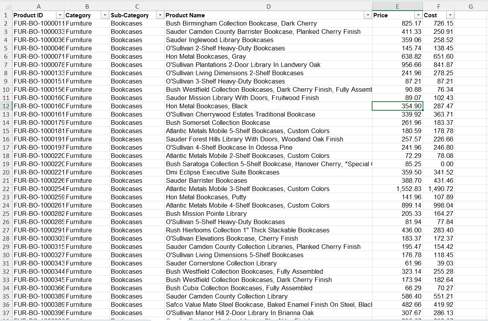
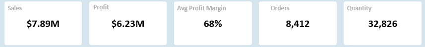

## Emmax Store Sale Dashboard Analysis: 2014–2017
## Dashboard Preview

# Business Objectives:
* Where is revenue coming from?
* Which Segments drives profit?
* What products deserves focus?'
* Is growth consistent month-to-month?

Tools Used:
* Excel
* KPI definition aligned with business objectives
* Interactive filtering (Region, Segment and Category)
* Visual Storytelling principles.

# Data Preparation:
* The dataset was an excel file downloaded from WhatsApp and the dataset was a normalized dataset which contained (Transaction, Customers and Products).
* On the worksheets, I checked for duplicates, null values and Standardized all columns to the appropriate data types.
* Cleaned all the categorical columns using the CLEAN, TRIM functions to remove all trailing and extra spaces.
* Changed all the categorical columns to a Proper case columns with the PROPER function.
* Merged all the worksheet into a single worksheet using the VLOOKUP function.

# Data Transformation
Calculated fields such as Revenue, Profit, and Profit Margin were derived to support performance evaluation. Data was also aggregated to enable time-based and category-based analysis.

   
     
# Data Analysis Techniques
Descriptive and comparative analytical techniques were applied, including:
* Trend analysis to evaluate sales performance over time.
* KPI analysis to measure Total Sales, Total Profit, Total Quantity, Total Orders, and Profit Margin.
* Product and customer analysis to identify key revenue drivers.
* These techniques enabled the identification of patterns, relationships, and performance gaps.

# Key Findings:
* Total Sales : $7.89M
* Total Profit: $6.23M
* Avg Profit Margin: 68%
* Orders: 8412
* Quantity Sold: 32,826
* 

* a. The Monthly Sales trend:
Sales peaked in November, reaching $1.18M, a significant increase from October's $743.79K. In contrast, February recorded the lowest sales performance at $304.11K, indicating a notable seasonal dip early in the year.

* b.Sales by Product Category:
 The Technology category emerged as the top-performing segment, generating the highest revenue of approximately $3.27M, which suggests strong demand for tech-related products. Conversely, Furniture recorded the lowest revenue at $2.38M, indicating comparatively weaker sales performance.

* c. Profit by Segment:
The analysis highlights that Revenue does not always translate directly into Profit. The Consumer segment delivered the highest profitability, contributing about $3.19M in profit, making it the most valuable customer group. Meanwhile, the Home Office segment generated the lowest profit at $1.14M, despite participating in overall revenue.

* d. Sales by Location
 The top performing states are California which topped by $1.45M, New York $1.16M and Pennsylvania $745K.
 
* e. Top 5 Performing Product
The Canon imageClass 2200 Advanced copier earned the highest revenue of $347K while the Fellows Pb300Plastic Comb Binding Machine had the 5th highest product by $95.06K.

# Recommendations:
1. Run targeted adverts or marketing for Top-selling technology items.
2. Stocks increase and promotional campaigns should be launched early around October so as to capture full seasonal demand as sales tends to rise during the Q4.
3. Introduce discount campaigns or loyalty programs to the Q1 period so as to stabilize revenue across all months.
4. Ensure discounts does not erode margins and track category- level margin trend to protect profitablility while scaling sales.
